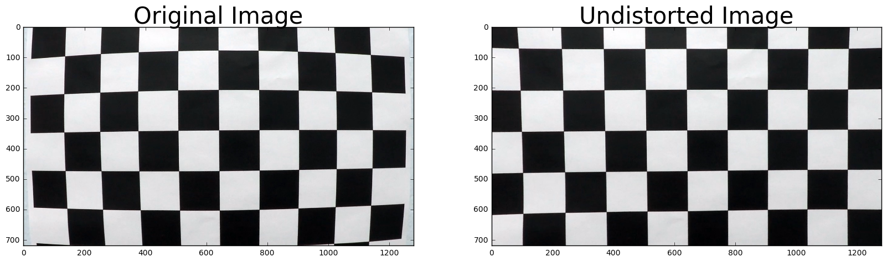

##Advanced Lane Finding Project
---

**Advanced Lane Finding Project**

The goals / steps of this project are the following:

* Compute the camera calibration matrix and distortion coefficients given a set of chessboard images.
* Apply a distortion correction to raw images.
* Use color transforms, gradients, etc., to create a thresholded binary image.
* Apply a perspective transform to rectify binary image ("birds-eye view").
* Detect lane pixels and fit to find the lane boundary.
* Determine the curvature of the lane and vehicle position with respect to center.
* Warp the detected lane boundaries back onto the original image.
* Output visual display of the lane boundaries and numerical estimation of lane curvature and vehicle position.

[//]: # (Image References)

[image1]: ./examples/undistort_output.png "Undistorted"
[image2]: ./test_images/test1.jpg "Road Transformed"
[image3]: ./examples/binary_combo_example.jpg "Binary Example"
[image4]: ./examples/warped_straight_lines.jpg "Warp Example"
[image5]: ./examples/color_fit_lines.jpg "Fit Visual"
[image6]: ./examples/example_output.jpg "Output"
[video1]: ./project_video.mp4 "Video"

## [Rubric](https://review.udacity.com/#!/rubrics/571/view) Points
###Here I will consider the rubric points individually and describe how I addressed each point in my implementation.  

---
###Writeup / README

The code for this project is included in lanefind.py


###Camera Calibration


####1. createCameraDistortionPickle   lanefind.py 88-131

This function is called once to create and save a pickle of the camera matrix and distortion coefficients. It loads up the checkerboard patterns and calls
```python
         ret, corners = cv2.findChessboardCorners(gray, (9,6), None)
```
to do the actual work. After it loads all the images it saves a pickle for later use.  This way we only have to spend time doing this once.

####2. correctCameraDistortion  lanefind.py 139-151

This function is called each time we want to undistort an image. The first time it is run it loads the pickle from disk into a global variable. This way we can speed up the transformations.  The actual work is done by:
```python
	    dst = cv2.undistort(image, mtx, dist, None, mtx)
```




###Pipeline (single images) lanefind.py 337-416

####1. distortion-correct image lanefind.py 342

```python
	orig_img = correctCameraDistortion(image)
```
correctCameraDistortion, as described before, will undistort the input image:


####2. Color and Gradeint Thresholds  lanefind.py 162-192

I used a python notebook AdvancedLaneFinding.ipynb to try a lot of different techniques to threshold the image. In the end, I used a rather simple one. I think to handle the harder challenges better, I would want to go back into my python notebook and dump a bunch of the bad frames and take another pass through it.

I find all the yellow pixels, and turn them on in the binary image.
I convert the image to HSV space and use sobel on the L channel. I then threshold and add back in the S channel. This is fairly simple and seems to work reasonably well.


####3. projectImageToBird and projectBirdToImage lanefind.py 194-210

```python
def projectImageToBird(image):
    src = np.float32([[585, 460], [203, 720], [1127, 720], [695, 460]])
    dst = np.float32([[320, 0], [320, 720], [960,720], [960, 0]])
    M = cv2.getPerspectiveTransform(src, dst)
    Minv = cv2.getPerspectiveTransform(dst, src)
    img_size = (image.shape[1], image.shape[0])
    binary_warped = cv2.warpPerspective(image, M, img_size, flags=cv2.INTER_LINEAR)
    return binary_warped
```

I used the two sets of points from the writeup example, to build two functions that use warpPerspective to go in or out of a birdseye view. It seems to work well.


####4. findLanesByHistogram  lanefind.py 214-279

findLanesByHistogram is a function that uses a histogram, and a sliding window to identifiy points that appear to be on the lane lines. It then fits two polynomials
to each of the lanes. Sometimes this function doesn't find the right thing, in which case two sets of code are used to throw out bad frames.  One checks for roughly parallel curves:  lanefind.py lines 363-365  and in the Line class update function, we toss lines that are two different a curvature from the previous line. lanefind.py lines 52-60

To improve this I think I would limit my search for subsequent lines to a window around the previously found line. I think improving the thresholding could improve the detection as well.


####5. findCurvature lanefind.py 284-305

This function takes the curves, and figures out the radius. It converts to meters as well.


####6. drawOutput lanefind.py 314-329

drawOutput reprojects the image back froma  birdseye view, and draws the found lane area in green.  The last steps of the lanePipeline 391-416 draw the curvature, offset, and some debug information on the image.


---

###Pipeline (video)

####1.  Here are two of the videos that do well. The harder challenge doesn't work well.

[project_video_out](./project_video_out.mp4)

[challenge_video_out](./challenge_video_out.mp4)

---

###Discussion

####1. Briefly discuss any problems / issues you faced in your implementation of this project.  Where will your pipeline likely fail?  What could you do to make it more robust?

 Unfortunately I spent more time working on a follow-on project to the Behaviour Cloning project https://www.youtube.com/watch?v=i03fPLzD1z4 and https://www.youtube.com/watch?v=xDuW0vXD2KY followed by a family ski trip.  If I had more time I would dump out bad frames from the challenge and harder-challenge and try to improve the thresholding code. I think that filtering the image a bit more, and I could get a much cleaner result.  Also, in my notebook I started to implement the other version of the lane finding algorithm.. I think if things fail, it would make sense to try different techniques, and maybe even a completey different thresholding algorithm (or parameters).  Also, I would add some more failure detection, ie: I think we could try to make sure the lane is a reasonable width.  We know roughly how wide a car is. 

